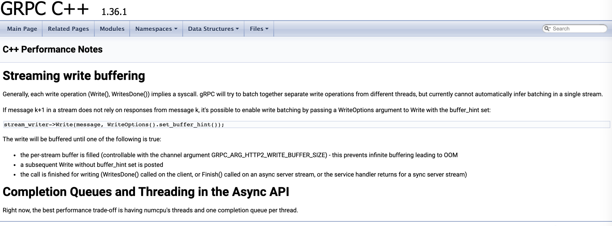

# 概述
研究官方提供的同步服务端和异步服务端的实例。 
# 1. 同步服务端天然支持并发， 异步服务端默认是单线程
## 1.1 同步客户端支持并发， 响应请求后，线程退出。
- 第一步，终端1执行命令：./greeter_server  -i 1 -a 2
- 第二步， 终端2执行：
```
root@nxddos:~# ps aux| grep greeter
root      3357  0.0  0.0 399268 10312 pts/2    Sl+  03:16   0:00 ./greeter_server -i 1 -a 2
root      3365  0.0  0.0  13116  1068 pts/1    S+   03:16   0:00 grep --color=auto greeter
root@nxddos:~# gdb attach 3357
```
- 第三步， 终端3执行：./multi-process 10
- 第四步， 观察gdb的结果
```
38  ../sysdeps/unix/sysv/linux/x86_64/syscall.S: No such file or directory.
(gdb) c
Continuing.
[New Thread 0x7f1281ee4700 (LWP 3417)]
[New Thread 0x7f12816e3700 (LWP 3418)]
[New Thread 0x7f1280ee2700 (LWP 3419)]
[New Thread 0x7f1263fff700 (LWP 3420)]
[New Thread 0x7f12637fe700 (LWP 3421)]
[New Thread 0x7f1262ffd700 (LWP 3422)]
[New Thread 0x7f12627fc700 (LWP 3423)]
[New Thread 0x7f1261ffb700 (LWP 3424)]
[New Thread 0x7f12617fa700 (LWP 3425)]
[New Thread 0x7f1260ff9700 (LWP 3426)]
[Thread 0x7f12627fc700 (LWP 3423) exited]
[Thread 0x7f12617fa700 (LWP 3425) exited]
[Thread 0x7f1261ffb700 (LWP 3424) exited]
[Thread 0x7f1262ffd700 (LWP 3422) exited]
[Thread 0x7f12637fe700 (LWP 3421) exited]
[Thread 0x7f1280ee2700 (LWP 3419) exited]
[Thread 0x7f12816e3700 (LWP 3418) exited]
[Thread 0x7f1281ee4700 (LWP 3417) exited]
[Thread 0x7f12826e5700 (LWP 3362) exited]

(gdb) info threads
  Id   Target Id         Frame
* 1    Thread 0x7f1285a6a800 (LWP 3357) "greeter_server" syscall ()
    at ../sysdeps/unix/sysv/linux/x86_64/syscall.S:38
  2    Thread 0x7f12846e9700 (LWP 3358) "default-executo" syscall ()
    at ../sysdeps/unix/sysv/linux/x86_64/syscall.S:38
  3    Thread 0x7f1283ee8700 (LWP 3359) "resolver-execut" syscall ()
    at ../sysdeps/unix/sysv/linux/x86_64/syscall.S:38
  4    Thread 0x7f12836e7700 (LWP 3360) "grpc_global_tim" syscall ()
    at ../sysdeps/unix/sysv/linux/x86_64/syscall.S:38
  5    Thread 0x7f1282ee6700 (LWP 3361) "grpc_health_che" syscall ()
    at ../sysdeps/unix/sysv/linux/x86_64/syscall.S:38
  10   Thread 0x7f1263fff700 (LWP 3420) "grpcpp_sync_ser" 0x00007f128480ba47 in epoll_wait (
    epfd=9, events=0x7f126c000cd0, maxevents=100, timeout=9992)
    at ../sysdeps/unix/sysv/linux/epoll_wait.c:30
  25   Thread 0x7f123e7fc700 (LWP 3476) "grpcpp_sync_ser" syscall ()
    at ../sysdeps/unix/sysv/linux/x86_64/syscall.S:38
```
## 1.1 异步服务端默认是单线程的

- 第一步执行 ./greeter_async_server  2
- 第二步执行：./multi-process 5
- 第三步查看日志：
```
# 服务端日志
root@nxddos:~/huashan/grpc/grpc_learn/demo10/demo10_1# ./greeter_async_server  2
Server listening on 0.0.0.0:50051
receive hello request, create
receive hello request, create
processing......
receive hello request, create
processing......
finish request
receive hello request, create
processing......
finish request
receive hello request, create
processing......
finish request
finish request
receive hello request, create
processing......
finish request
# 客户端日志
04:02:19:  4986|Child Process id:4986
Greeter received: Hello world
Greeter received: Hello world
Greeter received: Hello world
Greeter received: Hello world
Greeter received: Hello world
04:02:29:  4981|Children processes have exited.
04:02:29:  4981|Parent had exited.
process count:5, total_time:10s
```

可以看到请求是逐个处理的。

# 2. 同步服务端的问题
## 2.1 默认状况下， 线程数没有限制，为系统最大值
代码如下：
```
// The default value for maximum number of threads that can be created in the
// sync server. This value of INT_MAX is chosen to match the default behavior if
// no ResourceQuota is set. To modify the max number of threads in a sync
// server, pass a custom ResourceQuota object  (with the desired number of
// max-threads set) to the server builder.
#define DEFAULT_MAX_SYNC_SERVER_THREADS INT_MAX
```


问题：如果请求比较多，且请求的处理事件较长，线程回收过慢， 将会创建大量的线程。

测试如下：

- 第一步， 执行./greeter_server   -i 1 -a 2  -s 1000
- 第二步， 执行./multi-process  1000
- 第三步， 查看线程创建的信息：
```
root@nxddos:~# ps aux| grep gree| grep server
root     32321  324  0.1 4285580 29204 pts/2   Sl+  08:44   4:51 ./greeter_server -i 1 -a 2 -s 1000
root@nxddos:~# gdb attach 32321
    
info threads
查看有大量线程创建。
看代码grpc/src/cpp/thread_manager/thread_manager.cc的225行的warning， 大致如下：
    // Otherwise go back to polling as long as it doesn't exceed max_pollers_
    //
    // **WARNING**:
    // There is a possibility of threads thrashing here (i.e excessive thread
    // shutdowns and creations than the ideal case). This happens if max_poller_
    // count is small and the rate of incoming requests is also small. In such
    // scenarios we can possibly configure max_pollers_ to a higher value and/or
    // increase the cq timeout.
    //
    // However, not doing this check here and unconditionally incrementing
    // num_pollers (and hoping that the system will eventually settle down) has
    // far worse consequences i.e huge number of threads getting created to the
    // point of thread-exhaustion. For example: if the incoming request rate is
    // very high, all the polling threads will return very quickly from
    // PollForWork() with WORK_FOUND. They all briefly decrement num_pollers_
    // counter thereby possibly - and briefly - making it go below min_pollers;
    // This will most likely result in the creation of a new poller since
    // num_pollers_ dipped below min_pollers_.
    //
    // Now, If we didn't do the max_poller_ check here, all these threads will
    // go back to doing PollForWork() and the whole cycle repeats (with a new
    // thread being added in each cycle). Once the total number of threads in
    // the system crosses a certain threshold (around ~1500), there is heavy
    // contention on mutexes (the mu_ here or the mutexes in gRPC core like the
    // pollset mutex) that makes DoWork() take longer to finish thereby causing
    // new poller threads to be created even faster. This results in a thread
    // avalanche.
```

## 2.2 限制线程数， 当超出线程数时， 会出现请求失败的问题

当资源耗尽的时候， 通过调试程序以及阅读源码可知， 当超出给定的线程数的时候， 会调用如下回调，此时直接返回错误：

```
//grpc/src/cpp/server/server_cc.cc

CallData->Run    442行。

(gdb) p *$10
$12 = {
  _vptr.MethodHandler = 0x563ae9b9fb88 <vtable for grpc::internal::ErrorMethodHandler<(grpc::StatusCode)8>+16>}
(gdb)
```
测试如下：

- 第一步执行./greeter_server   -i 1 -a 2  -t 10 -s 10
- 第二步执行./multi-process  100
- 第三步查看第二步的执行结果：

```
Greeter received: RPC failed
Greeter received: RPC failed
8:
8:
Greeter received: RPC failed
Greeter received: RPC failed
8:
Greeter received: RPC failed
8:
Greeter received: RPC failed
8:
Greeter received: RPC failed
8:
Greeter received: RPC failed
Greeter received: Hello world
Greeter received: Hello world
```

上面显示Greeter received: RPC failed的即为执行失败的情况。

## 2.3 同步服务端如何优雅的退出


# 3 异步服务端的问题

## 3.1 如何设置线程数，以及队列数

官方说明是， 一个核对应一个poll， 一个poll 对应一个queue, 如下：
```
  /// Add a completion queue for handling asynchronous services.
  ///
  /// Best performance is typically obtained by using one thread per polling
  /// completion queue.
  ///
  /// Caller is required to shutdown the server prior to shutting down the
  /// returned completion queue. Caller is also required to drain the
  /// completion queue after shutting it down. A typical usage scenario:
  ///
  /// // While building the server:
  /// ServerBuilder builder;
  /// ...
  /// cq_ = builder.AddCompletionQueue();
  /// server_ = builder.BuildAndStart();
  ///
  /// // While shutting down the server;
  /// server_->Shutdown();
  /// cq_->Shutdown();  // Always *after* the associated server's Shutdown()!
  /// // Drain the cq_ that was created
  /// void* ignored_tag;
  /// bool ignored_ok;
  /// while (cq_->Next(&ignored_tag, &ignored_ok)) { }
  ///
  /// \param is_frequently_polled This is an optional parameter to inform gRPC
  /// library about whether this completion queue would be frequently polled
  /// (i.e. by calling \a Next() or \a AsyncNext()). The default value is
  /// 'true' and is the recommended setting. Setting this to 'false' (i.e.
  /// not polling the completion queue frequently) will have a significantly
  /// negative performance impact and hence should not be used in production
  /// use cases.
  std::unique_ptr<grpc::ServerCompletionQueue> AddCompletionQueue(
      bool is_frequently_polled = true);
```



## 3.2 多个请求的时候，将出现排队问题

查看1.1的测试。

## 3.3 异步服务端，如何使用动态线程池

# 4. 总结
- 同步服务端的问题：  默认下，线程数目不可控， 且如果设置线程数的最大个数，将出现访问失败的情况， 如果不设置最大线程数， 当进行高并发请求的时候，将出现线程回收慢，导致创建大量线程的情况，即线程数量不可控。
- 异步服务端的情况：默认下， 为单线程模式， 当存在多个情况的时候， 会出现排队问题。 尤其针对于引擎现在的模型， 多个控制平面的进程共用一个核， 这就会有些请求不能及时响应。
# 5. 附录

## 5.1 程序使用方法说明
```
Usage:./greeter_server -i <min_poll_num> -a <max_poll_num> -t <thread_pool_max_num> -s <sleep_time>(1-1000)ms
```
- -i指最小的poll线程个数
- -a指最大的poll线程个数
- -t指设置最大线程数
- -s指每线程空转cpu的时间，在这里并不是调用的sleep函数
## 5.2 源码分析
如果我们使用grpc c++的同步API来实现一个server,就如官方的grpc/examples/cpp/helloworld/greeter_server.cc例子所示。

那么如果同时来到多个rpc请求的话，线程模型是如何的呢？

通过阅读代码，可知线程模型会如下图所示：


grpc会使用线程池来处理所有文件描述fds上的事件，线程池中的线程分为2种，一种是专门用来处理epoll事件的，另一种是用来执行rpc请求的。

### 5.2.1 线程池算法
- 处理epoll事件的线程的数量最小个数min_pollers_默认是1.
- 处理epoll事件的线程的数量最大个数max_pollers_默认是2.
- 最小最大epoll线程个数可以设置
- 初始状态只有1个默认线程处理epoll,当有并发rpc请求到来时，每一个rpc请求都会创建一个线程来处理rpc请求.保证至少有min_pollers个线程处理epoll.
- 当rpc处理完成时，会有部分线程转换为epoll线程（不超过最大个数max_pollers，其它线程退出）
- 当超过最小epoll线程个数min_pollers的线程epoll超时(默认10s)还没有新请求处理时,也会退出。
