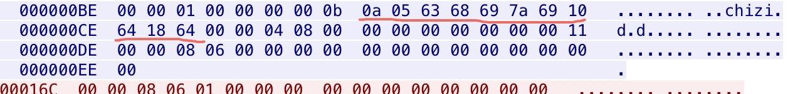

# 概述
抓包对比C封装后的消息结构，和grpc通信时的消息结构的差别，
经过执行./test和查看grpc.pcap包，发现是一样的。 
# 测试步骤
- 步骤1.执行make命令
- 步骤2.执行 ./server
- 步骤3.执行抓包命令：tcpdump -i any port 50051 -w grpc.pcap
- 步骤4.执行python client.py
- 步骤5.执行./test

# 输出结果
当执行步骤5的时候，输出结果如下：
```
root@nxddos:~/demo4# ./test
len:11
a 5 63 68 69 7a 69 10 64 18 64
```

查看抓包文件， 使用16进制模式显示， 截图如下：


